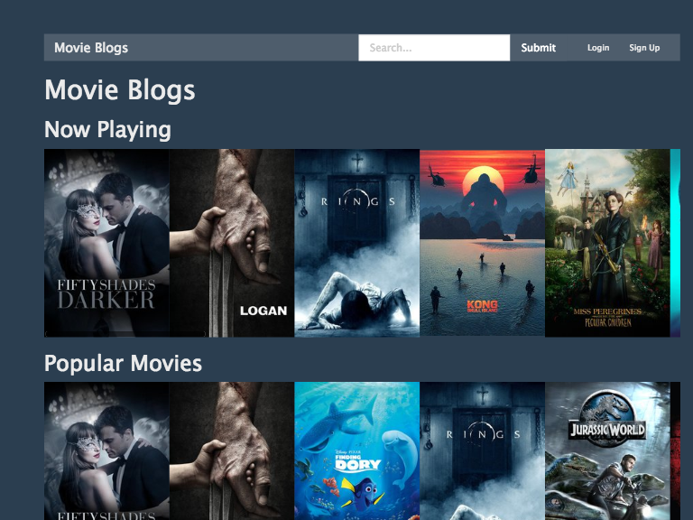
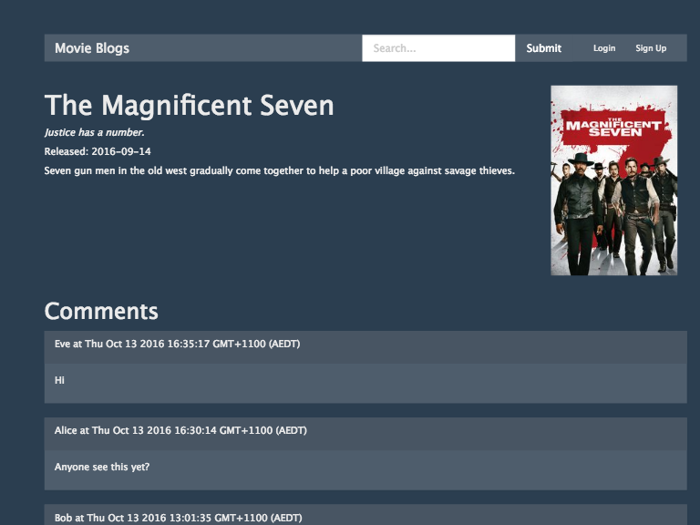
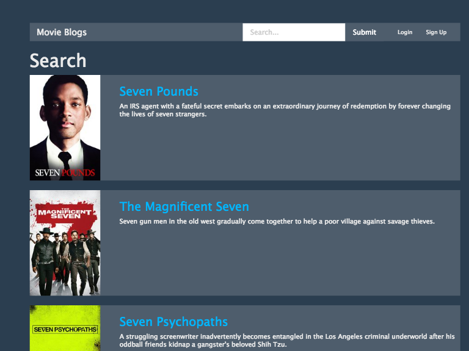

# moviecomments

See recent and popular movies, search for movies, and comment on individual movies. Uses [The Movie Database API](https://www.themoviedb.org/).

Initially created for ISYS1126 Web Database Applications, Assignment 2, Semester 2 2016.





## First run

To download the dependencies, run ```npm install```. To run the application, run ```npm start```. A MongoDB instance is expected to be running at ```localhost:27017```.

By default the application accepts web connections on port 3000, so to view it in a web browser navigate to [http://localhost:3000/](http://localhost:3000/).


## Attributions

- [Node.js](https://nodejs.org)
- [Express.js](https://expressjs.com)
- [Request](https://github.com/request/request)
- [Mongoose](http://mongoosejs.com/)
- [Bootswatch](http://bootswatch.com/)
- [Passport](http://passportjs.org/)
